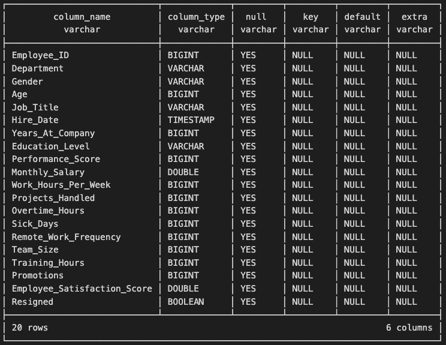

# Employment Performance Analysis Portfolio

## **Introduction and Goal**

This project explores workforce dynamics through comprehensive analyses of critical metrics such as engagement, productivity, and compensation. The goal is to uncover strategies that enhance workforce effectiveness, improve employee satisfaction, and drive organizational success in a competitive landscape.

---

## **Process and Tools**

### **DuckDB for High-Performance Data Analysis**

This project leverages DuckDB's high-performance capabilities and advanced SQL features like Window Functions and Common Table Expressions (CTEs) to analyze and wrangle data effectively.

#### **Key Benefits of DuckDB**:

1. **Lightweight and Embedded**: DuckDB is serverless, making it easy to set up and use directly on your local machine.
2. **High Performance**: Optimized for analytical queries, it can handle large datasets efficiently.
3. **SQL Support**: Its advanced SQL dialect supports complex queries like joins, window functions, and more.
4. **Integration**: DuckDB integrates seamlessly with Python and other analytical tools.

### **Installation Instructions for DuckDB**

Follow these steps to install and set up DuckDB on your system:

1. Install DuckDB via `pip`:
   ```bash
   pip install duckdb
   ```
2. Verify the installation:
   ```bash
   python -c "import duckdb; print(duckdb.__version__)"
   ```

## **Dataset Information**

The analysis is based on a dataset that includes key metrics related to employment performance. Below is an overview of the data used in this project:

### Data Overview:


